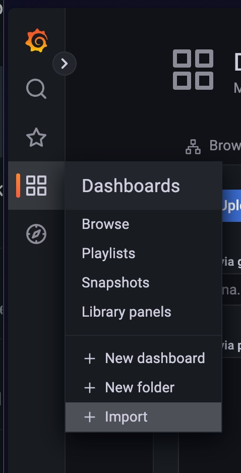
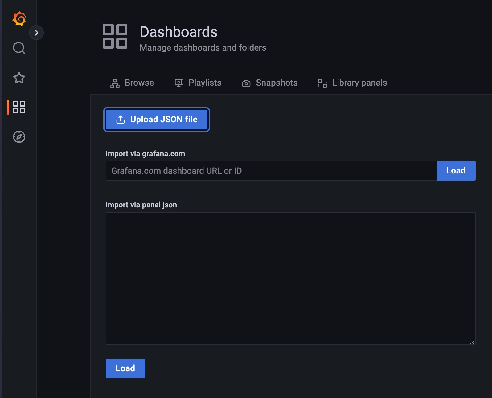
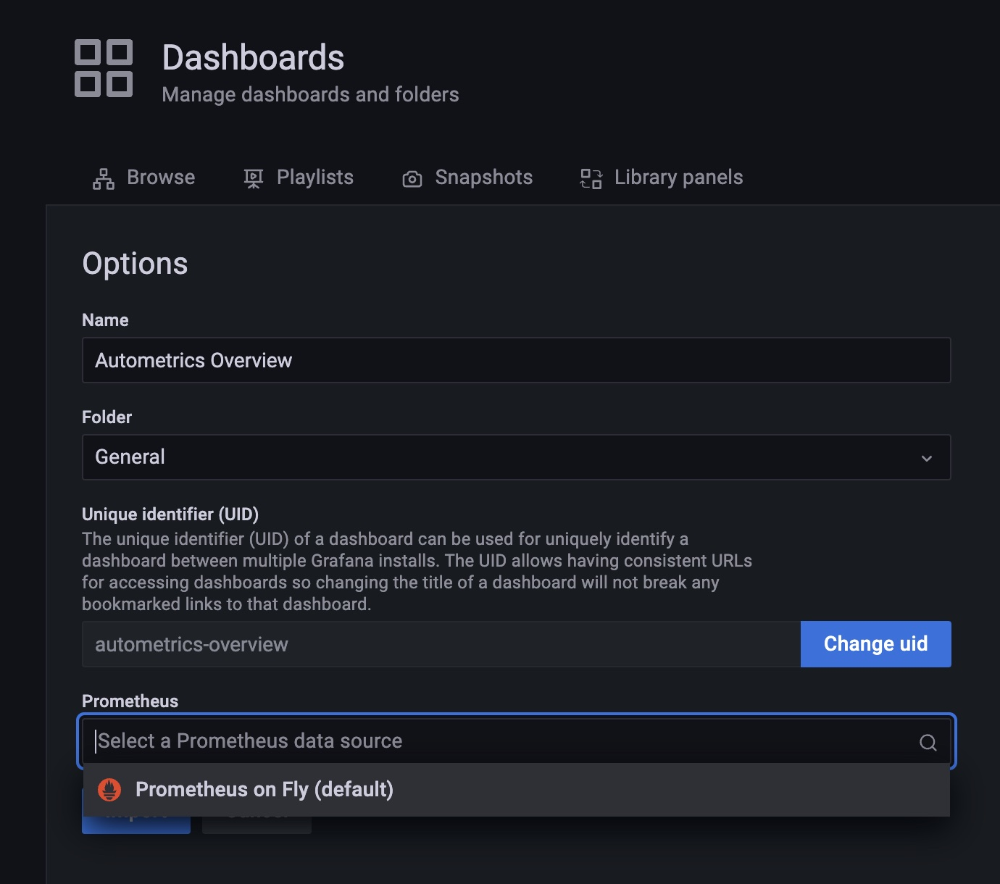
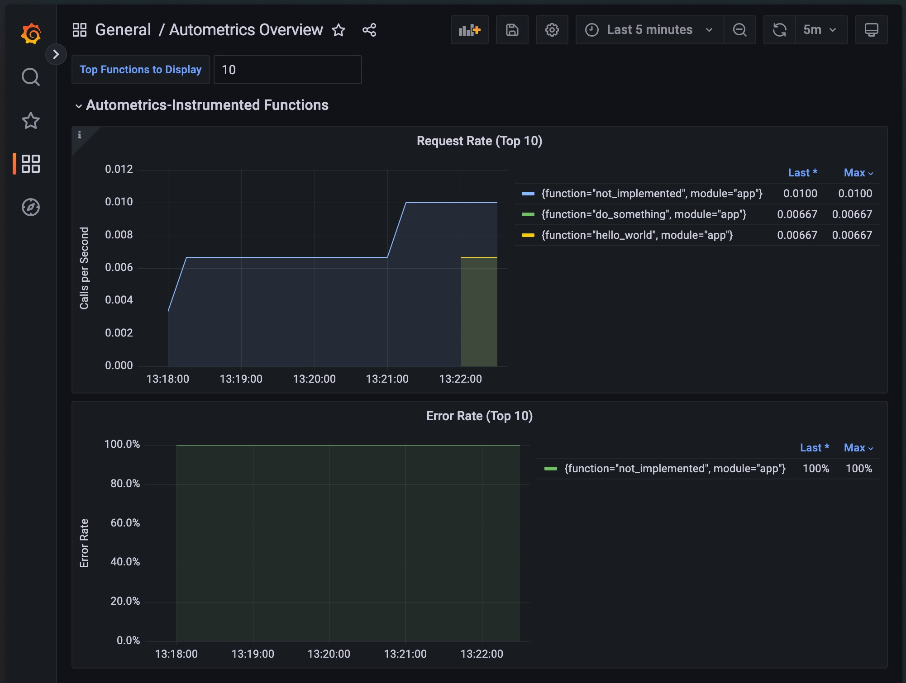

# Getting started FastAPI & Fly.io

In this tutorial we'll create a simple back-end application that uses autometrics to track several of the api calls. If only interested in how to deploy a small [fastapi](https://fastapi.tiangolo.com/) app and see autometrics in action on fly.io, you can just clone this repository and continue at the [deploy & monitor section](#deploy--monitor). This app will report metrics like:

- success rate
- error ratio
- latency

## Requirements

In order to set this project up locally you need:

- [poetry](https://python-poetry.org). This is used for managing dependencies
- Python 3.7 or newer
- [Fly.io](https://fly.io/) account and their CLI installed [flyctl](https://fly.io/docs/hands-on/install-flyctl/)
- optionally: [docker](https://www.docker.com/) if you want to build the container locally

## Starting the project from scratch

Let's start off by creating a new directory and go to it

```sh
mkdir fastapi-fly
cd fastapi-fly
```

Next step is starting the project using poetry:

```sh
poetry init
```

This will trigger a wizard asking for:

- your package name (the default `fastapi-fly` is fine)
- version number (the default `0.1.0` value is also fine)
- description (can be left empty)
- author (you can leave empty or use the default value)
- license (which I will set to MIT, but can be left empty )
- Compatible Python version should be at least Python 3.7 or higher
- defining dependencies interactively: which we won't do
- defining development dependencies interactively: which we won't do either
- for confirmation of the generation (Which should be answered with the default yes)

Let's add the our first set of dependencies:

```sh
poetry add fastapi autometrics prometheus-client uvicorn
```

Which will add the needed dependencies and install them.

After this we're ready to add some code. Create a file named `app.py` in your favorite editor and add the following code:

```python
import time
from autometrics import autometrics
# Import below is needed for the service level objective (SLO) support
from autometrics.objectives import Objective, ObjectiveLatency, ObjectivePercentile
from fastapi import FastAPI, Response
from prometheus_client import start_http_server
import uvicorn

app = FastAPI()


# Set up the root endpoint of the API
@app.get("/")
# Add the autometrics decorator to enable metrics for this endpoint
# It needs to be added AFTER the fastapi decorator otherwise it won't
# be triggered
@autometrics
def hello_world():
    do_something()
    return {"Hello": "World"}


# Let's set up a service level objective (SLO), so we can check out
ITEM_SLO = Objective(
    "sleep",
    success_rate=ObjectivePercentile.P99_9,
    latency=(ObjectiveLatency.Ms250, ObjectivePercentile.P99),
)


@app.get("/sleep/")
@autometrics(objective=ITEM_SLO)
def get_sleep(duration: int = 0):
    """A function that takes a duration parameter to determine how much the response
    needs to be delayed"""

    time.sleep(duration)
    return {"duration": duration}


@app.get("/not-implemented")
@autometrics
def not_implemented():
    """An endpoint that always throws an exception"""
    raise NotImplementedError("Not implemented")

@autometrics
def do_something():
    # This function doesn't do much
    print("done")

# In order for prometheus to get the data we'll set
# up a separate endpoint that exposes data in a format
# that prometheus can understand.
# This metrics server will run on port 8008
start_http_server(8008)

# If the app is not run by fly.io in a container but using python
# directly we enter this flow and it is run on port 8080
if __name__ == "__main__":
    uvicorn.run(app, host="localhost", port=8080)

```

Technically you can now run this example locally using:

```sh
poetry run python app.py
```

You can navigate to `localhost:8080` to see a small JSON response:

```json
{ "Hello": "World" }
```

And if you go to `localhost:8008` you can see the metrics that prometheus will scrape:

```text
# HELP function_calls_count_total Autometrics counter for tracking function calls
# TYPE function_calls_count_total counter
function_calls_count_total{caller="hello_world",function="do_something",module="app",objective_name="",objective_percentile="",result="ok"} 1.0
function_calls_count_total{caller="run",function="hello_world",module="app",objective_name="",objective_percentile="",result="ok"} 1.0
```

It will contain more data than just the autometrics ones but entries starting with `function_...` are typically generated by autometrics. Now that we've seen the code in action, let's start with the preparations for the deploy.

## Preparing for deployment

In order to run on fly.io two more files are needed:

1. A dockerfile (though it's also possible to deploy without using a dockerfile)
2. fly.toml file (a configuration file containing information about which port the app is running on and whether or not custom metrics are used)

Let's first write the Dockerfile.

```dockerfile
FROM python:3.11
# Install poetry
RUN pip install poetry

# This is the folder where our app will live
WORKDIR /code
COPY ./poetry.lock ./pyproject.toml /code/

# Gereate requirements.txt and install dependencies
RUN poetry export -f requirements.txt --output requirements.txt --without-hashes && pip install -r requirements.txt

# Copy the python code into the container
COPY app.py /code/

# Expose the port that the app (by default) is running on
EXPOSE 8080

# Start the app in a flexible way, so it can be run on Heroku, Azure App Services, or locally
# Heroku uses PORT, Azure App Services uses WEBSITES_PORT, Fly.io uses 8080 by default
CMD ["sh", "-c", "uvicorn app:app --host 0.0.0.0 --port ${PORT:-${WEBSITES_PORT:-8080}}"]
```

Next step: prepare for deployment to fly.io by creating a fly.toml file and in this case we do want to create this file before running the `launch` command because there is some additional configuration that needs to be added so prometheus on fly.io will scrape our metrics endpoint.

Here is the minimal fly.toml file:

```toml
[http_service]
  internal_port = 8080
  force_https = true

[metrics]
  port = 8008
  path = "/metrics"
```

### Deploy & monitor

Now we're ready to deploy to fly.io. You can do this using the launch command:

```bash
flyctl launch --now
```

This will launch a wizard that will ask a few questions:

1. An existing fly.toml file was found. Would you like to copy its configuration to the new app? This should be answered with `yes~
2. Choose an app name. For one this will determine the URL under which you can access the app. You can leave it empty and use a generated one
3. Choose a region for deployment. For me the Amsterdam region is suggested, but other regions should work fine.
4. Create .dockerignore from .gitignore? The default option No is fine.

After that the actual deploy will happen, if this is your first application a builder machine might be launched

```
Wrote config file fly.toml
==> Building image
Remote builder fly-builder-divine-shadow-9546 ready
==> Creating build context
--> Creating build context done
==> Building image with Docker
--> docker host: 20.10.12 linux x86_64
[+] Building 3.2s (0/1)
```

After which the dockerfile will be build & pushed to the fly.io registry:

```
 => [internal] load remote build context                                                                                                                                              0.0s
 => copy /context /                                                                                                                                                                   0.3s
 => [internal] load metadata for docker.io/library/python:3.11                                                                                                                        0.7s
 => CACHED [1/6] FROM docker.io/library/python:3.11@sha256:f7382f4f9dbc51183c72d621b9c196c1565f713a1fe40c119d215c961fa22815                                                           0.0s
 => [2/6] RUN pip install poetry                                                                                                                                                     11.5s
 => [3/6] WORKDIR /code                                                                                                                                                               0.0s
 => [4/6] COPY ./poetry.lock ./pyproject.toml /code/                                                                                                                                  0.0s
 => [5/6] RUN poetry install                                                                                                                                                          2.4s
 => [6/6] COPY . /code/                                                                                                                                                               0.2s
 => exporting to image                                                                                                                                                                0.8s
 => => exporting layers                                                                                                                                                               0.8s
 => => writing image sha256:59b6775d0d880a37c84527171f527987bbf96391b04725d1b4e2a17cfb8fa0e1                                                                                          0.0s
 => => naming to registry.fly.io/black-lake-4279:deployment-01GYFM65WZ6MVDS3FHR0CMKJHV                                                                                                0.0s
--> Building image done
==> Pushing image to fly
The push refers to repository [registry.fly.io/black-lake-4279]
```

After which the app is launched. Note: the name `black-lake-4279` is a randomly generated and information like ip addresses will likely be unique/different from what you're seeing.

```
--> Pushing image done
image: registry.fly.io/black-lake-4279:deployment-01GYFM65WZ6MVDS3FHR0CMKJHV
image size: 1.1 GB
Provisioning ips for black-lake-4279
  Dedicated ipv6: 2a09:8280:1::24:fc4
  Shared ipv4: 66.241.125.89
  Add a dedicated ipv4 with: fly ips allocate-v4
Process groups have changed. This will:
 * create 1 "app" machine

No machines in group 'app', launching one new machine
  [1/1] Waiting for 1781949b255d48 [app] to become healthy: 0/1
```

Once everything is done the fly.toml file will be updated with the information like the region you've deployed to and the name of the app. It's good to check its contents because it's easy to deploy the app in a way that metrics aren't picked up (i.e. if you use the default answer to the `would you like to copy its configuration` question).

It should look something like:

```toml
# fly.toml file generated for black-lake-4279 on 2023-04-21T09:58:50+02:00

app = "black-lake-4279"
primary_region = "ams"

[http_service]
  internal_port = 8080
  force_https = true

[metrics]
  port = 8008
  path = "/metrics"
```

It's also good to verify that everything is running, by running:

```bash
flyctl status
```

```
App
  Name     = black-lake-4279
  Owner    = personal
  Hostname = black-lake-4279.fly.dev
  Image    = black-lake-4279:deployment-01GYHMK6F9RC78MAGR852F19PM
  Platform = machines

Machines
PROCESS ID              VERSION REGION  STATE   CHECKS  LAST UPDATED
app     6e82d492f65308  1       ams     started         2023-04-21T10:08:55Z
```

If it's not in a started state (i.e. stopped) something went wrong and you may want to check the logs to see why the app isn't starting (for instance using `flyctl logs`)

Time to open the website in a browser by running `flyctl open`. This will also trigger some metrics to be generated. Besides visiting the root of the site, you may also want to navigate to `/not-implemented` (which will result in an exception/internal server error) as well go to `/sleep` which response is delayed by `duration`, which you can pass in as a query string parameter (i.e. `/sleep?duration=1` will delay the response by one second). The sleep endpoint also has a decorator that ties the SLO with the function. So right now there should be data in Prometheus and in order to access it we can use the managed grafana (currently available as an early preview).

Autometrics comes with several dashboards you can import and which will allow you to easily explore the metrics. The dashboards can be found in the [autometrics-shared repository](https://github.com/autometrics-dev/autometrics-shared). Let's add them to grafana!

1. Go to your apps dashboard by running `flyctl dashboard` and go the the `metrics` page and on the metrics page click on the `open in grafana` button.
2. Now that you're on grafana, navigate to the imports page, by clicking the dashboards icon in the side menu and click on `+ Import`  
   
3. Go to the [autometrics-shared repository](https://github.com/autometrics-dev/autometrics-shared) repository and download the `Autometrics overview.json`
4. Click on the `Upload JSON file` button and select the just downloaded JSON file.  
   
5. You will see a new form which will be mostly filled in except the `Prometheus` field. There `Prometheus on Fly (default)` needs to be selected.  
   
6. Finally: click `import` and you will be redirected to the dashboard.

It should look something similar to:



Feel free to import the other dashboards and see more detailed information around SLO's and function specific details.

That's it! If you have ideas for improving autometrics or feedback around this example, feel free to open up a ticket on our github repository: https://github.com/autometrics-dev/autometrics-py or contact us on [discord](https://discord.gg/kHtwcH8As9)
